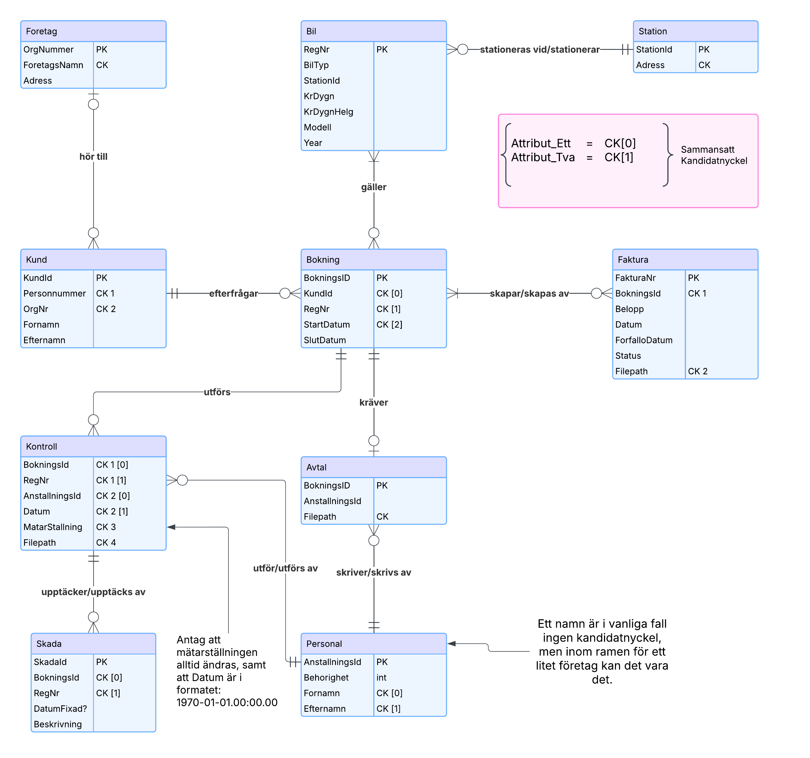

# D0004N Datamodellering - Uppgift 1
En simpel SQL-klient som stödjer hela den logiska datamodellen.  
Se till att sätta upp samtliga tables och kör sedan <b>USER_RESTRICTIONS.sql</b> för att lägga till restriktioner etc. <b>PERSONAL.sql</b> skapar två poster med olika rättigheter.
  
Inga funktioner för extern fillagring och skapning har implementerats (samtliga <b>Filepath</b> är nullable).

#### För att bygga
    dotnet restore
    dotnet build

#### Kör programmet
    dotnet run

Se till att sätta upp tables och ändra <u><b>Transactor.DB</b></u> till att peka på din DB.

## Exempel på Körning
    
    Green Rental DB - Huvudmeny
    Kontroller och skador kan inte postas om en bil har ett slutdatum. I det scenariot skapas en faktura preliminärt.
    1. Registrera bil
    2. Registrera station
    3. Registrera Personal
    4. Visa alla bilar + status
    5. Visa stationer
    6. Hyr ut Bil
    7. Inlämning av bil samt skadekontroll.
    q. Avsluta
    
    6
    Är det en företagskund? (J/N):
    n
    Personnummer: 20010730
    Bokning skapad med BokningsId = 14.
    Vill du ange slutdatum (S), eller hyra löpande fr.o.m. nu (L)?
    s
    Slutdatum (yyyy-mm-dd): 2025-03-25
    Ange RegNr (eller lämna tomt för att avsluta): BBB777
    Bil BBB777 lades till bokningen.
    Ange RegNr (eller lämna tomt för att avsluta):
    Samtliga valda bilar lades till bokningen.
    Skapade faktura med beloppet: 5000
    AnställningsId för den som skriver avtal: 1
    Avtal signerat.

# Logisk Datamodell

# Konceptuell Datamodell

