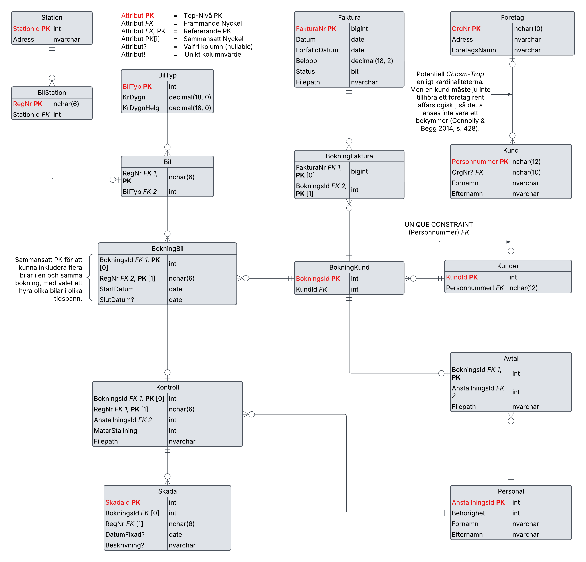

# D0004N Datamodellering - Uppgift 1
Elias Töyrä  
En simpel SQL-klient.  
Använder OS tid för att se tillgängligheten på bilar, samt för att beräkna kostnad på fakturor etc.  
Om en bil "lämnas in" i "framtiden", så kommer den fortsatt att anses vara "uthyrd" (även om en faktura har skapats)
  
Inga funktioner för kontroller eller skador etc..

#### För att bygga skiten
    dotnet restore
    dotnet build

#### Kör programmet
    dotnet run

Se till att sätta upp tables och ändra <u><b>Transactor.DB</b></u> till att peka på din DB.

#### Exempel på Transaktion
    Green Rental DB - Huvudmeny
    Steg 1 - 3 krävs för att hyra en bil.
    1. Registrera bil
    2. Registrera station
    3. Registrera Personal
    4. Visa alla bilar + status
    5. Visa stationer
    6. Hyr ut Bil
    7. Inlämning av bil
    q. Avsluta

    6
    Är det en företagskund? (J/N):
    N
    Personnummer: 200107304444
    Bokning skapad med BokningsId = 5.
    Vill du ange slutdatum (S), eller hyra löpande fr.o.m. nu (L)?
    L
    Ange RegNr (eller lämna tomt för att avsluta): LYE715
    Bil LYE715 lades till bokningen.
    Ange RegNr (eller lämna tomt för att avsluta): DEX123
    Bil DEX123 lades till bokningen.
    Ange RegNr (eller lämna tomt för att avsluta):
    Samtliga valda bilar lades till bokningen.
    AnställningsId för den som skriver avtal: 1
    Avtal signerat.

# Logisk Datamodell

# Konceptuell Datamodell
